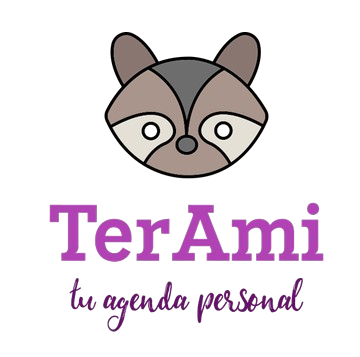

<p align="center">
    
</p>

<h1 align="center">TerAmi</h1>

<p align="center">
    Una aplicación gamificada de gestión de tareas y rutinas personales. 📚⏰
</p>

<p align="center">
    <a href="https://laravel.com/docs"></a>
    <a href="#"></a>
    <a href="https://opensource.org/licenses/MIT"></a>
</p>

---

## 🚀 Acerca de TerAmi

**TerAmi** es una aplicación web diseñada para ayudarte a gestionar tus tareas diarias con una interfaz atractiva y motivadora. Al estilo Duolingo, Terami te impulsa a mantener el ritmo con tus objetivos personales, académicos o laborales.

> ✔ Ideal para estudiantes, freelancers, o cualquier persona que quiera organizar mejor su tiempo y hábitos.

---

## 🧰 Tecnologías utilizadas

- ⚙️ **Laravel 12** - Framework backend
- 🎨 **Bootstrap 5** - Estilos y diseño responsive
- 🗃️ **MySQL** con **phpMyAdmin** - Base de datos
- 🧠 **Workbench** - Modelado de base de datos
- 🎯 **Figma** - Diseño de interfaz UI/UX

---

## 📥 Instalación rápida

```bash
git clone https://github.com/andreaprada1993/TerAmiWeb.git
cd TerAmi

composer install
cp .env.example .env
php artisan key:generate

php artisan migrate
php artisan serve
